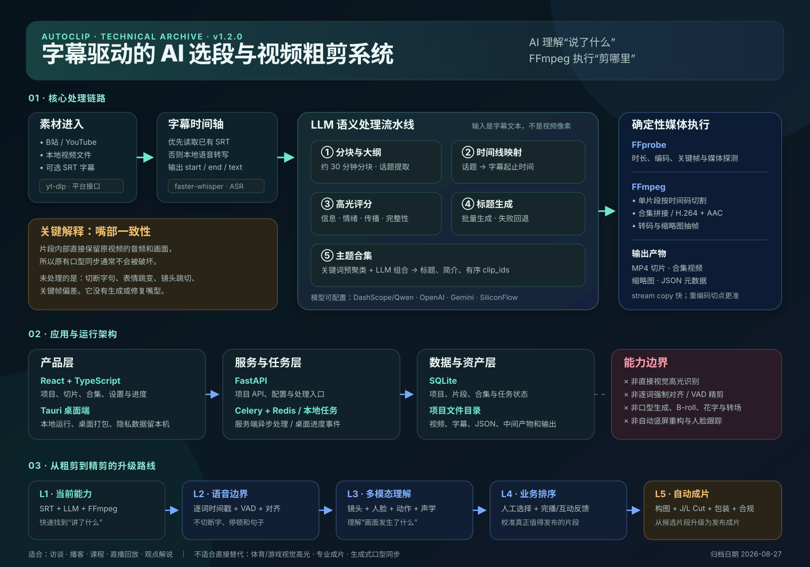

# AutoClip 能力与技术原理归档



## 基本信息

| 项目 | 内容 |
| --- | --- |
| 上游仓库 | [zhouxiaoka/autoclip](https://github.com/zhouxiaoka/autoclip) |
| 研究基准 | [`v1.2.0` / `17100c05252b9a947ea1a857f8d0ea4f3af2317b`](https://github.com/zhouxiaoka/autoclip/tree/17100c05252b9a947ea1a857f8d0ea4f3af2317b) |
| 开源许可证 | [MIT](https://github.com/zhouxiaoka/autoclip/blob/17100c05252b9a947ea1a857f8d0ea4f3af2317b/LICENSE) |
| 研究状态 | `archived`：完成能力、原理和采用价值归档；未做本地运行与质量验证 |
| 最后更新 | 2026-08-27 |

## 一句话结论

AutoClip 是一个**字幕驱动的 AI 选段与视频粗剪系统**：它把长视频转换成带时间戳的文字，让大语言模型理解话题、选择片段、评分、命名和分组，再由 FFmpeg 按时间码切割原视频。

它不是依靠画面动作发现高光的多模态剪辑器，也不负责口型生成、镜头包装、B-roll、花字或自动竖屏重构。

```text
长视频
→ 字幕 / 语音转写
→ LLM 理解话题与内容价值
→ 字幕时间码定位候选片段
→ FFmpeg 切割与拼接
→ 可人工复核的切片和合集
```

## 这个库的意义

AutoClip 的价值不在于提出了新的音视频算法，而在于把一条常见、昂贵、重复的视频粗剪流程产品化：

1. **把“看完整段长视频找内容”改成“先读字幕语义再定位时间段”**，显著减少访谈、课程、播客和直播回放的人工筛选成本。
2. **把生成式 AI 限定在适合它的环节**：LLM 负责理解和判断，FFmpeg 负责确定性执行，不让模型直接操作媒体字节。
3. **把一次性脚本做成完整工作流**：包含素材导入、转写、处理进度、片段管理、主题合集和文件输出。
4. **提供一个可复用的粗剪基线**：以后遇到“长内容拆短内容”的需求，可以先复用这条链路，再按业务需要增加更精确的声画分析。

对我们的直接意义是：它适合作为“内容理解驱动剪辑”的参考实现或 MVP 起点，不适合作为无需人工复核的专业成片系统。

## 它到底能做什么

### 已实现的主流程

| 阶段 | 能力 | 主要技术 | 产物 |
| --- | --- | --- | --- |
| 素材进入 | B站、YouTube、本地视频导入 | yt-dlp、B站接口、本地上传 | 原视频、平台字幕、元数据 |
| 字幕准备 | 读取 SRT；没有字幕时本地转写 | faster-whisper | 带起止时间的字幕片段 |
| 内容拆解 | 长字幕分块并提取话题大纲 | 约 30 分钟分块、LLM | 结构化话题与子话题 |
| 时间定位 | 把话题映射回字幕时间轴 | LLM + 时间范围校验 | 候选片段起止时间 |
| 高光选择 | 判断信息价值、情绪、传播性和完整性 | LLM 综合评分；默认阈值约 0.7 | 高分片段与推荐理由 |
| 内容包装 | 生成片段标题 | LLM 批处理与失败回退 | 标题和片段元数据 |
| 合集组织 | 将相关片段组合成主题合集 | 固定关键词预聚类 + LLM | 合集标题、简介、有序片段 ID |
| 视频输出 | 单片段切割、合集拼接、缩略图 | FFmpeg、FFprobe | MP4、缩略图、JSON 元数据 |

### 产品与工程能力

- React + TypeScript 前端管理项目、片段、合集和设置。
- FastAPI 提供项目与处理接口。
- Tauri 支持桌面端本地运行与打包。
- SQLite 与项目文件目录保存记录、中间 JSON 和媒体文件。
- Web/服务端模式可使用 Celery + Redis 运行异步任务。
- 桌面模式可使用本地任务与进度事件，不强制依赖 Redis。
- 支持 DashScope/Qwen、OpenAI、Gemini、SiliconFlow 等模型配置。

## 核心技术原理

### 1. 字幕是理解层与视频层之间的桥

系统不需要让 LLM 直接读取整段视频。每条字幕天然包含：

```json
{
  "start": "00:12:08.400",
  "end": "00:12:15.100",
  "text": "这一段讲产品为什么需要先做用户验证"
}
```

LLM 对文字做内容理解，程序再用字幕的 `start/end` 找回原视频区间。因此它的本质可以概括为：

```text
语音/字幕 → 带时间戳文本 → 语义选择 → 时间码 → 视频切割
```

### 2. 长文本分块避免上下文过长

完整长视频字幕可能超过单次模型上下文或导致成本过高。系统先按时间窗口分块，分别提取大纲，再合并、去重。这样可以控制单次输入规模，但也可能丢失跨块上下文。

### 3. LLM 负责主观判断，程序负责结构约束

大纲、片段价值、标题与合集都包含主观语义判断，适合由 LLM 完成；时间格式、区间边界、片段 ID、文件路径和媒体处理则由程序约束。这个分工比让模型直接“剪视频”更稳定。

### 4. 高光是“文本语义高光”，不是“视觉高光”

评分信号主要来自字幕内容，例如信息密度、观点完整性、情绪共鸣和传播潜力。系统没有证明会综合分析人物表情、动作强度、镜头运动、观众欢呼、球赛得分或游戏击杀等视觉/声学事件。

所以它适合“精彩点由说了什么决定”的内容，不适合“精彩点主要由画面发生了什么决定”的内容。

### 5. FFmpeg 是确定性的媒体执行器

LLM 只给出起止时间和结构化元数据；真正的切割、拼接、转码、探测和抽帧由 FFmpeg/FFprobe 完成。单片段快速切割如果使用 stream copy，切点可能受关键帧位置影响；合集重新编码通常更准确，但耗时和画质损失更高。

## 嘴部一致性：它处理了吗

没有专门处理口型，也通常**不需要重新做口型同步**。

原因是 AutoClip 截取的是原视频中的连续声画区间，区间内部的音频和嘴部动作本来就是同步的；它没有替换台词，也没有重新生成嘴型。真正的问题出现在切点：

- 可能从一个字、一次吸气或一句话中间开始/结束。
- 人物表情和身体动作可能在边界处突然跳变。
- 如果快速切割依赖邻近关键帧，实际画面边界可能不如字幕时间码精确。
- 拼接多个不连续片段时，虽然各片段内部声画同步，但片段之间仍可能显得生硬。

因此“口型同步”和“剪辑连续性”是两件事：前者一般被原始声画保留，后者没有被充分解决。

## 更精确的技术路线

如果要从字幕粗剪升级到可直接发布的智能剪辑，可分层增加：

| 精度层级 | 新增技术 | 解决的问题 |
| --- | --- | --- |
| L1 字幕语义粗剪 | SRT + LLM + FFmpeg | 快速找到“讲了什么” |
| L2 语音边界精剪 | 逐词时间戳、forced alignment、VAD、标点恢复 | 避免切断字、呼吸和句子 |
| L3 声学事件理解 | 音量、语速、停顿、笑声、掌声、音乐变化 | 找到字幕以外的情绪和节奏信号 |
| L4 视觉理解 | 镜头边界、人物/人脸跟踪、表情、动作、OCR、场景识别 | 识别真正依赖画面的高光 |
| L5 多模态排序 | 文本、音频、视觉特征融合；业务数据训练排序器 | 提升高光选择的稳定性和个性化 |
| L6 成片优化 | J/L Cut、关键帧重编码、智能留白、转场、B-roll、花字、竖屏重构 | 从“可用切片”升级为“可发布成片” |
| L7 生成式修复（可选） | 口型修复、补帧、扩图、语音重生成 | 处理改写台词或极端跳切；成本和风险最高 |

更合理的升级顺序是先做 L2 和 L4，再考虑生成式口型。大部分粗剪质量问题来自切点和镜头连续性，并不是口型模型不足。

## 适用与不适用场景

### 适合

- 访谈、播客、课程、会议、直播回放。
- 知识类、观点类、测评类、新闻解说类长视频。
- 需要先批量产生候选片段，再由编辑人工复核的团队。
- 需要快速验证“长视频拆短视频”产品闭环的 MVP。

### 不适合直接使用

- 体育、游戏、舞蹈、音乐现场、影视混剪等以画面动作承载高光的内容。
- 对逐帧切点、节奏、镜头语言和播出质量要求很高的专业成片。
- 改写台词后仍要求新语音与嘴型完全一致的生成式视频任务。
- 无人工审核、直接批量发布的高风险内容生产。

## 对我们的价值

### 可直接复用

1. **字幕中间表示**：统一用带时间戳文本连接 ASR、LLM 与 FFmpeg。
2. **分阶段流水线**：每一步生成结构化中间产物，便于重跑、调试和人工修改。
3. **模型与媒体工具分工**：LLM 做语义决策，确定性工具执行文件操作。
4. **候选优先**：先生成候选和推荐理由，再让人确认，比完全自动发布更符合当前模型能力。
5. **桌面/服务端双运行模式**：本地隐私与云端批处理可以共用一套业务流水线。

### 不应直接继承

1. 把字幕评分当作完整的视频理解。
2. 使用固定阈值代替针对业务和平台的数据校准。
3. 仅依靠 LLM 自报分数，缺少历史点击、完播率或人工选择数据闭环。
4. 忽略关键帧、语音边界和镜头边界带来的切点质量问题。
5. 在未验证成本、时延和版权合规前直接进入大规模生产。

## 可扩展方向与优先级

### P0：先把粗剪变准

- 引入 Whisper 逐词时间戳与 forced alignment。
- 用 VAD、停顿、标点和最短留白修正片段首尾。
- 检测场景切换和关键帧，选择更自然的画面切点。
- 保存模型原始判断、评分维度和人工修改，形成可复盘数据。

### P1：升级为多模态高光系统

- 融合字幕、音频强度、笑声/掌声、镜头切换、表情和动作特征。
- 使用业务相关的人工选择数据训练排序器，而不是完全依赖通用 LLM 分数。
- 为访谈、课程、体育、游戏等内容类型建立不同策略。

### P2：升级为自动成片系统

- 自动竖屏重构、人脸跟踪与多人构图。
- B-roll 检索、字幕样式、花字、封面和转场模板。
- J/L Cut、片段间节奏优化和背景音乐 ducking。
- 输出前增加版权、敏感内容、事实和品牌合规检查。

### P3：形成运营闭环

- 接入平台发布、标题/封面多版本测试和排期。
- 回收点击率、完播率、互动率与人工采用率。
- 用反馈持续校准评分、片段长度、标题和合集策略。

## 采用判断

| 目标 | 判断 |
| --- | --- |
| 作为长视频语义粗剪工具 | 值得参考，链路完整且实现成本可控 |
| 作为访谈/课程切片 MVP | 值得复用，但必须保留人工复核 |
| 作为多模态高光检测器 | 不够，需要音频与视觉模型扩展 |
| 作为专业自动成片系统 | 不够，需要切点、构图、包装和质量控制 |
| 作为口型同步方案 | 不适用；它保留原声画，不生成或修复嘴型 |

## 后续重新启用条件

出现以下需求时重新回顾此归档：

- 需要把访谈、课程、播客或直播批量拆成短视频。
- 需要构建“ASR → 内容理解 → 时间码 → FFmpeg”的内容生产流水线。
- 需要评估字幕粗剪、多模态高光和自动成片三者的技术边界。
- 需要在桌面本地处理与服务端批处理之间选择架构。
- 准备建立基于人工选择、完播率或互动率的剪辑评分闭环。

重新启用时应先检查上游新版本，并优先验证：逐词切点准确率、关键帧偏差、人工采用率、单小时视频处理成本和端到端耗时。

## 证据边界

### 已确认

- 上游提供 B站、YouTube、本地文件导入与字幕/转写入口。
- 主处理链路包含大纲、时间线、评分、标题、合集和视频生成。
- 媒体执行依赖 FFmpeg，文本理解依赖可配置 LLM。
- 项目同时包含桌面端、Web 后端、数据库与异步任务设计。

### 本次未验证

- 本地从零部署成功率与桌面安装体验。
- Whisper 转写速度、准确率与硬件占用。
- LLM 高光评分与人工编辑判断的一致性。
- stream copy 切点偏差与不同编码格式兼容性。
- 大规模批处理稳定性、成本和线上发布效果。

因此本文是技术归档和选型参考，不是生产质量背书。

## 参考资料

- [上游 README](https://github.com/zhouxiaoka/autoclip/blob/17100c05252b9a947ea1a857f8d0ea4f3af2317b/README.md)
- [固定研究版本 v1.2.0](https://github.com/zhouxiaoka/autoclip/tree/17100c05252b9a947ea1a857f8d0ea4f3af2317b)
- [设计说明](https://github.com/zhouxiaoka/autoclip/blob/17100c05252b9a947ea1a857f8d0ea4f3af2317b/DESIGN.md)
- [路线图](https://github.com/zhouxiaoka/autoclip/blob/17100c05252b9a947ea1a857f8d0ea4f3af2317b/ROADMAP.md)
- [构建指南](https://github.com/zhouxiaoka/autoclip/blob/17100c05252b9a947ea1a857f8d0ea4f3af2317b/BUILD_GUIDE.md)
- [更新记录](https://github.com/zhouxiaoka/autoclip/blob/17100c05252b9a947ea1a857f8d0ea4f3af2317b/CHANGELOG.md)
