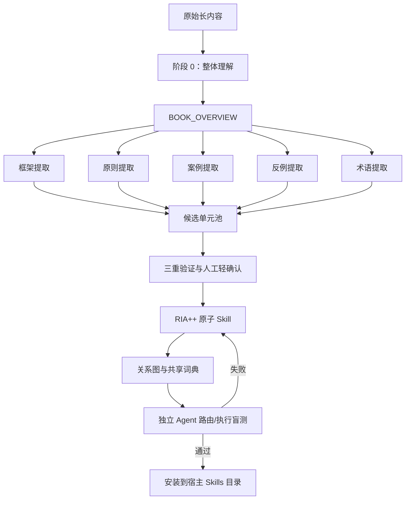

# cangjie-skill 研究记录

## 基本信息

| 项目 | 内容 |
| --- | --- |
| 上游仓库 | <https://github.com/kangarooking/cangjie-skill> |
| 研究基准 | `5f03a4cd8b521673f7a67ca6279330ec943bb369` |
| 上游版本 | `main`，包含标签 `v2.0.0` |
| 开源许可证 | MIT |
| 研究状态 | `archived` |
| 最后更新 | 2026-08-28 |

研究基准固定到上游提交 [`5f03a4c`](https://github.com/kangarooking/cangjie-skill/tree/5f03a4cd8b521673f7a67ca6279330ec943bb369)。本轮没有把上游元 Skill 安装到 Codex、Claude Code、Cursor 或用户级 Skills 目录；只把受控实验产出的 `incident-learning-audit` 安装到本仓库级 `.agents/skills/` 做验证。

## 当前结论

`cangjie-skill` 是一套把书籍、长视频转写、播客、课程和访谈转成 Agent Skills 的**元 Skill、方法规范与模板集合**，不是模型训练项目、RAG 系统或完整的自动化蒸馏引擎。

它最重要的设计不是“总结长内容”，而是把来源中的方法论转换为四种 Agent 可消费的信息：

1. **触发条件**：用户在什么情境和语言信号下需要这个方法。
2. **执行协议**：Agent 被触发后按哪些步骤工作，每步如何判断完成。
3. **边界条件**：何时不适用、何时停止、与相邻 Skill 如何区分。
4. **验证资产**：来源引用、候选与淘汰轨迹、正向/诱饵/边界测试题。

仓库自身并不执行上述流水线。真正的执行者是宿主 Agent：它读取上游 [`SKILL.md`](https://github.com/kangarooking/cangjie-skill/blob/5f03a4cd8b521673f7a67ca6279330ec943bb369/SKILL.md)，调用 sub-agent、读写文件、盲测结果，并最终把生成目录安装到宿主的 Skills 目录。

## 研究问题

本项目将回答以下问题：

1. RIA-TV++ 相比普通摘要、RAG 和直接生成 Skill，实际改善了什么？
2. “三重验证”能验证方法论质量，还是主要验证书内一致性？
3. 压力测试能否稳定测出 Skill 路由的漏触发、误触发和兄弟 Skill 冲突？
4. 长文本分块、五路并行和回炉机制的成本、方差及失败恢复如何？
5. 哪些部分可以直接吸收到我们的研究平台，哪些必须工程化补齐？

## 能力地图

| 能力 | 上游入口 | 机制 | 当前证据 | 初步判断 |
| --- | --- | --- | --- | --- |
| 整体理解 | [`methodology/01-stage0-adler.md`](https://github.com/kangarooking/cangjie-skill/blob/5f03a4cd8b521673f7a67ca6279330ec943bb369/methodology/01-stage0-adler.md) | 结构、解释、批判、应用四步分析 | 有规范和模板，代理语料已实跑 | 方法清楚，质量依赖模型阅读能力 |
| 五路提取 | [`extractors/`](https://github.com/kangarooking/cangjie-skill/tree/5f03a4cd8b521673f7a67ca6279330ec943bb369/extractors) | 框架、原则、案例、反例、术语五种独立视角 | 代理语料产出 247 条候选 | 是提示词分工，不是确定性提取器 |
| 三重验证 | [`methodology/03-stage1.5-triple-verify.md`](https://github.com/kangarooking/cangjie-skill/blob/5f03a4cd8b521673f7a67ca6279330ec943bb369/methodology/03-stage1.5-triple-verify.md) | 多语境佐证、外推能力、非普通常识 | 首个候选经验证和收窄 | 是质量门，但不是外部事实核验 |
| 原子 Skill 构造 | [`templates/SKILL.md.template`](https://github.com/kangarooking/cangjie-skill/blob/5f03a4cd8b521673f7a67ca6279330ec943bb369/templates/SKILL.md.template) | R/I/A1/A2/E/B 六段结构 | 本地已生成正式 Skill | 当前最成熟、最可迁移的部分 |
| Skill 关系图 | [`methodology/05-stage3-zettelkasten.md`](https://github.com/kangarooking/cangjie-skill/blob/5f03a4cd8b521673f7a67ca6279330ec943bb369/methodology/05-stage3-zettelkasten.md) | 依赖、对比、组合三类边 | 官方样例存在 INDEX 关系图 | 目前是文档关系，尚非可执行 DAG |
| 路由压力测试 | [`methodology/06-stage4-pressure-test.md`](https://github.com/kangarooking/cangjie-skill/blob/5f03a4cd8b521673f7a67ca6279330ec943bb369/methodology/06-stage4-pressure-test.md) | 正向、诱饵、边界及兄弟 Skill 混淆测试 | 本地独立回归 19 / 19 | 机制有效，仍需更多业务域样本 |
| 断点续跑 | [`SKILL.md`](https://github.com/kangarooking/cangjie-skill/blob/5f03a4cd8b521673f7a67ca6279330ec943bb369/SKILL.md) | `PIPELINE_STATE.md` 记录阶段 | 没有对应模板或运行器 | 目前是流程约定，不是状态机 |
| 安装交付 | [`methodology/07-stage5-deliver.md`](https://github.com/kangarooking/cangjie-skill/blob/5f03a4cd8b521673f7a67ca6279330ec943bb369/methodology/07-stage5-deliver.md) | 复制/链接到宿主 Skills 目录 | 已验证 Codex 仓库级安装 | 仍需按宿主平台补适配器 |

## 架构与关键流程



运行时没有新增模型参数。宿主先读取 Skill 的 `name` 和 `description`，根据用户问题选择是否加载完整 `SKILL.md`；加载后，模型按照 A2 触发条件、E 执行步骤和 B 边界完成任务。因此它更接近“可路由的程序性上下文”，而不是把知识写入模型权重。

## 仓库资产盘点

基准提交包含：

- 18 个 Markdown 文件；
- 8 份阶段方法文档；
- 5 份 extractor prompt；
- 5 份输出模板；
- 1 个 Python 脚本；
- 1 个 GitHub Actions 工作流；
- README、图片和宣传资产。

唯一的 Python 脚本 [`generate_star_history.py`](https://github.com/kangarooking/cangjie-skill/blob/5f03a4cd8b521673f7a67ca6279330ec943bb369/scripts/generate_star_history.py) 只调用 GitHub API 生成 Star History 图，与内容蒸馏主流程无关。仓库没有主流程 CLI、包清单、解析器、模型调用层、任务队列、自动评测器或安装器源码。DeepSeek Harness 适配层由 Release 单独分发，不在当前源码树中。

所以当前工程边界应表述为：

```text
仓库提供：方法、提示词、模板、人工检查点、目标目录合同
宿主提供：长内容读取、模型推理、sub-agent、文件操作、测试执行、安装能力
外部系统提供：PDF/OCR/ASR、权限、事实核验、运行观测、版本发布
```

## 第一轮验证摘要

详细证据见 [`VALIDATION.md`](VALIDATION.md)。当前已经确认：

- 上游固定在 `5f03a4cd8b521673f7a67ca6279330ec943bb369`，子模块工作区干净。
- `test-prompts.json.template` 是合法 JSON，预置 3 个 `should_trigger`、2 个 `should_not_trigger` 和 1 个 `edge_case`。
- 当前输出规范要求 9 类模板化产物，但仓库只为其中 5 类提供模板；`PIPELINE_STATE`、`verified`、`GLOSSARY` 和 `test-results` 没有模板。
- 官方巴菲特样例固定提交 `5b1fbe1d93f155fcf4acf236841bf8e1b5951c91`，包含 20 个 Skill 和 20 份合法测试文件。
- 样例 20 个 Skill 全部具有 R/I/A1/A2/E/B 六段，测试类型数量也符合最低要求。
- 样例没有任何 `test-results.md`，缺少 `PIPELINE_STATE.md`、`GLOSSARY.md`、`DIGEST.md`；两个 Skill 明确写着“待阶段 4 验证”，其余 Skill 没有测试通过率记录。

该样例生成于 2026-04-16，而当前上游基准为 2026-08-26，因此暂时把差异归类为**样例与当前规范的版本漂移或执行证据缺失**，不能仅凭此断言当前规范无法产出完整结果。

## 对我们可迁移的设计

### 可以优先吸收

1. 用 `description` 明确“何时调用、何时不调用、语言信号”。
2. 用 R/I/A1/A2/E/B 统一程序性知识的内部合同。
3. 候选、淘汰和来源证据全部保留，避免只交付最终 Prompt。
4. 测试同时包含正向、诱饵、边界及兄弟 Skill 冲突。
5. 每个方法原子化，并显式记录依赖、对比和组合关系。

### 采用前必须补齐

1. 机器可校验的 Schema，而不是主要依赖自由格式 Markdown。
2. 可重复执行的状态机、重试、缓存、成本和模型版本记录。
3. 固定评测集与自动回归，输出 precision、recall、路由混淆矩阵和执行质量评分。
4. 来源定位与外部事实核验分层，避免把书内重复误当成真实世界证据。
5. Skill 注册、版本、权限、失效时间、灰度和回滚。
6. Codex、Claude、Cursor、DeepSeek 等不同宿主的输出适配层。

## 首个受控实验进度

《左耳听风：传奇程序员练级攻略》实验入口见 [`experiments/zuoer-tingfeng/`](experiments/zuoer-tingfeng/)。由于当前只有纸质书，本轮没有获取或复制受版权保护的书籍全文，而是把 119 篇第三方专栏镜像作为独立的 `Column Proxy Track`。它不是纸质书替代品，结论仅属于该代理语料。

代理语料已完成 Stage 0–1 五路提取，得到 247 条候选；首个候选经三重验证后修订为 `incident-learning-audit`，完成 RIA++ 构造、19 / 19 独立压力回归、Codex 仓库级安装和 Cloudflare 公开事故完整审计。Stage 5C 组织案例接入合同已就绪，但当前组织案例仍为 0；另外三项能力方向仍处于候选状态。

库级 Web 演示已把该实验放回正确位置：先说明 Cangjie Skill 支持的 8 类来源与 6 项能力，再展示 5 个上游代表案例，最后把《左耳听风》作为证据最深的本地受控案例。运行和验收入口见 [`web-demo/`](experiments/zuoer-tingfeng/column-proxy/web-demo/README.md)。

## 当前采用判断

| 维度 | 判断 |
| --- | --- |
| 方法论价值 | 高 |
| 开箱即用程度 | 中 |
| 自动化程度 | 低 |
| 生产可审计性 | 设计中等，实证不足 |
| 二次开发价值 | 高 |
| 当前建议 | 作为内部 Skill Factory 的设计输入，先做受控试点，不直接批量生产 |

本轮研究已经收束并归档。下一次重新启动的条件不是继续阅读上游文档，而是出现一个明确产品需求：有合法可用的长内容、有需要重复执行的方法、有目标 Agent 宿主，并且愿意用真实任务评估路由准确率和执行质量。

## 参考资料

- [库能力与落地说明](LIBRARY_CAPABILITY_GUIDE.md)
- [同类库与产品生态比较](ECOSYSTEM_COMPARISON.md)
- [上游代表案例目录](UPSTREAM_CASE_CATALOG.md)
- [上游 README](https://github.com/kangarooking/cangjie-skill/blob/5f03a4cd8b521673f7a67ca6279330ec943bb369/README.zh-CN.md)
- [元 Skill 执行规范](https://github.com/kangarooking/cangjie-skill/blob/5f03a4cd8b521673f7a67ca6279330ec943bb369/SKILL.md)
- [RIA-TV++ 总览](https://github.com/kangarooking/cangjie-skill/blob/5f03a4cd8b521673f7a67ca6279330ec943bb369/methodology/00-overview.md)
- [压力测试规范](https://github.com/kangarooking/cangjie-skill/blob/5f03a4cd8b521673f7a67ca6279330ec943bb369/methodology/06-stage4-pressure-test.md)
- [官方 Buffett Skill Pack](https://github.com/kangarooking/buffett-letters-skill)
