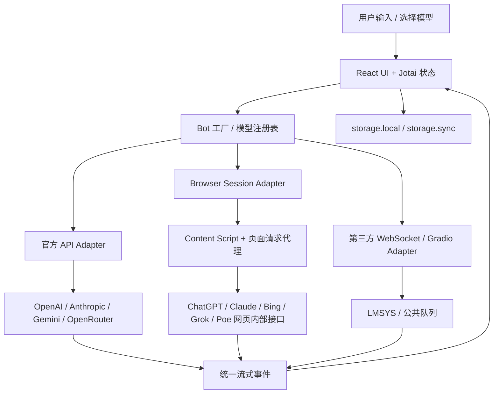

# ChatHub 研究记录

## 基本信息

| 项目 | 内容 |
| --- | --- |
| 上游仓库 | <https://github.com/chathub-dev/chathub> |
| 研究基准 | `a7a2bd6e12050d6a39fcaf30868bdfd7ccf78f22`（`main`，2026-02-27） |
| 主要实现版本 | Manifest `1.45.7`；核心实现主要形成于 2023 年，2025 年仅有少量接口维护 |
| 开源许可证 | GPL-3.0 |
| 研究状态 | `verified`（源码静态验证，未使用真实账号做端到端登录验证） |
| 最后更新 | 2026-08-27 |

## 一句话结论

ChatHub 是一个运行在浏览器扩展中的多模型客户端：它以统一 Bot 接口屏蔽不同模型的请求和流式协议差异，既支持官方 API/API Key，也支持复用用户浏览器登录态（Cookie、Session、Access Token、CSRF）调用网页内部接口；上层据此实现模型切换与多模型并行回答。

它适合作为“统一模型适配层 + 浏览器会话代理层 + 流式标准化”的参考样例，不适合作为我们后续产品的直接技术底座。真正值得沉淀的是架构边界和协议，不是仓库中已经老化的具体模型接口。

## 研究目标与范围

本次研究回答五个问题：

1. ChatHub 如何把不同模型接入同一个界面？
2. 它使用官方 API，还是复用用户网页账号？
3. 一个入口让多个模型同时回复是如何实现的？
4. 自由切换模型需要沉淀哪些通用能力？
5. 哪些代码值得继续研究，哪些不值得投入？

本次结论来自源码静态审阅，包括 Manifest、Provider/Bot 实现、Content Script、页面请求代理、流式解析、前端状态、并发调用、历史存储和提交记录。没有使用 ChatGPT Plus、Claude Pro、Bing、Poe 或 Grok 真实账号做运行验证，因此不能把“源码存在某个适配器”等同于“该适配器在 2026 年仍可正常工作”。

## 核心能力地图

| 能力 | 真实实现 | 关键源码 | 结论 |
| --- | --- | --- | --- |
| 统一模型接口 | `AbstractBot` 统一发送、重置、图片能力与流式事件 | [`abstract-bot.ts`](https://github.com/chathub-dev/chathub/blob/a7a2bd6e12050d6a39fcaf30868bdfd7ccf78f22/src/app/bots/abstract-bot.ts) | 值得抽象为内部 Provider SDK |
| 模型选择 | `createBotInstance(botId)` 按 ID 创建不同 Bot | [`bots/index.ts`](https://github.com/chathub-dev/chathub/blob/a7a2bd6e12050d6a39fcaf30868bdfd7ccf78f22/src/app/bots/index.ts) | 本质是注册表/工厂，不是复杂智能路由 |
| 官方 API 接入 | OpenAI、Azure、Anthropic、Gemini、OpenRouter、Perplexity 等分别实现请求 | [`chatgpt-api/index.ts`](https://github.com/chathub-dev/chathub/blob/a7a2bd6e12050d6a39fcaf30868bdfd7ccf78f22/src/app/bots/chatgpt-api/index.ts) | API Key 只负责鉴权，协议仍需逐家适配 |
| 网页账号接入 | 复用浏览器登录态，读取或换取 Token，调用网页内部接口 | [`chatgpt-webapp/client.ts`](https://github.com/chathub-dev/chathub/blob/a7a2bd6e12050d6a39fcaf30868bdfd7ccf78f22/src/app/bots/chatgpt-webapp/client.ts) | 浏览器扩展场景有参考价值，生产稳定性低 |
| 页面代理 | Content Script 在已登录页面上下文中执行请求，通过扩展 Port 回传流 | [`chatgpt-inpage-proxy.ts`](https://github.com/chathub-dev/chathub/blob/a7a2bd6e12050d6a39fcaf30868bdfd7ccf78f22/src/content-script/chatgpt-inpage-proxy.ts)、[`proxy-fetch.ts`](https://github.com/chathub-dev/chathub/blob/a7a2bd6e12050d6a39fcaf30868bdfd7ccf78f22/src/services/proxy-fetch.ts) | 值得沉淀为 Browser Bridge，而不是绑定 ChatGPT |
| 流式标准化 | SSE、ReadableStream、WebSocket 最终归一为回答更新、完成和错误 | [`abstract-bot.ts`](https://github.com/chathub-dev/chathub/blob/a7a2bd6e12050d6a39fcaf30868bdfd7ccf78f22/src/app/bots/abstract-bot.ts) | 是跨模型 UI 的关键中间层 |
| 多模型并行 | 同一输入分别调用多个 `useChat(botId)`，各自更新面板 | [`MultiBotChatPanel.tsx`](https://github.com/chathub-dev/chathub/blob/a7a2bd6e12050d6a39fcaf30868bdfd7ccf78f22/src/app/pages/MultiBotChatPanel.tsx) | 本质是前端并发 N 次独立请求 |
| 停止与错误 | 每个 Bot 使用独立 `AbortController` 和错误状态 | [`use-chat.ts`](https://github.com/chathub-dev/chathub/blob/a7a2bd6e12050d6a39fcaf30868bdfd7ccf78f22/src/app/hooks/use-chat.ts) | 可扩展为统一重试、降级和 fallback |
| 历史与配置 | 历史存入 `storage.local`，Key/模式等配置存入 `storage.sync` | [`chat-history.ts`](https://github.com/chathub-dev/chathub/blob/a7a2bd6e12050d6a39fcaf30868bdfd7ccf78f22/src/services/chat-history.ts)、[`user-config.ts`](https://github.com/chathub-dev/chathub/blob/a7a2bd6e12050d6a39fcaf30868bdfd7ccf78f22/src/services/user-config.ts) | 适合个人扩展，不满足企业密钥治理 |
| 简单联网 Agent | 模型决定是否搜索，抓取 DuckDuckGo/Bing News 摘要后再回答 | [`agent/index.ts`](https://github.com/chathub-dev/chathub/blob/a7a2bd6e12050d6a39fcaf30868bdfd7ccf78f22/src/services/agent/index.ts) | 只有单工具、短摘要和正则解析，研究价值有限 |

## 架构与关键流程



### 分层理解

ChatHub 的能力应拆成四层，而不是笼统称为“多模型调度”：

```text
API Key / Cookie / Session
→ 认证层：证明调用者有权访问

Provider Adapter
→ 协议适配层：转换请求、模型名、消息、图片、工具和错误

Stream Normalizer
→ 流式标准化层：统一 SSE、ReadableStream 和 WebSocket 事件

Model Router / Executor
→ 调度层：选择、切换、并发、取消、重试和降级
```

认证成功并不等于完成模型接入。即使全部使用官方 API，每家厂商仍有不同的请求格式、上下文机制、流式事件、工具调用、图片/文件格式、错误码和用量统计，需要分别实现 Adapter。

## 两条模型接入路径

### 路径 A：官方 API / API Key

```text
用户或平台配置 API Key
        ↓
选择 ChatGPT API / Claude API / Gemini 等模式
        ↓
Bot 工厂创建对应 API Adapter
        ↓
Adapter 按厂商协议构造请求
        ↓
解析厂商流式响应
        ↓
转换成统一 UI 事件
```

以 ChatGPT 为例，配置层支持 `Webapp`、`API`、`Azure`、`Poe`、`OpenRouter` 等模式；初始化时根据模式创建不同 Bot。[`chatgpt/index.ts`](https://github.com/chathub-dev/chathub/blob/a7a2bd6e12050d6a39fcaf30868bdfd7ccf78f22/src/app/bots/chatgpt/index.ts)

这条路径的长期价值最高。我们可以基于官方 SDK 和官方文档建立稳定、可测试的 Provider Adapter，并把 API Key 保存在服务端密钥系统，而不是暴露在浏览器端。

### 路径 B：浏览器 Cookie / Session / Token

```text
用户在目标网站完成登录
        ↓
浏览器保存 Cookie / Session
        ↓
扩展检测登录状态或请求 session 接口
        ↓
获取 Access Token / CSRF / conversation 信息
        ↓
在扩展或目标网页上下文调用内部接口
        ↓
通过 Runtime Port 将流式响应传回扩展 UI
```

ChatGPT Web 适配器会请求网页会话接口获取 Access Token；需要时打开并固定一个 ChatGPT 标签页，通过 Content Script 在页面上下文代理请求。[`requesters.ts`](https://github.com/chathub-dev/chathub/blob/a7a2bd6e12050d6a39fcaf30868bdfd7ccf78f22/src/app/bots/chatgpt-webapp/requesters.ts)

其他网页适配器采用相似但不统一的办法：

| 网页服务 | 主要会话材料 | 交互方式 |
| --- | --- | --- |
| ChatGPT Web | Cookie/Session → Access Token | 内部 HTTP + SSE + 页面代理 |
| Claude Web | Cookie、组织 ID、对话 ID | 内部 HTTP + SSE |
| Bing | 登录态、Conversation 信息 | HTTP 建会话 + WebSocket |
| Grok/X | Cookie、CSRF Token、固定 Bearer | 内部 HTTP 流 |
| Poe | Cookie、formkey、GraphQL 会话信息 | GraphQL + WebSocket |

网页路径通常没有公开、稳定的开发手册。它依赖浏览器网络请求分析和网站内部协议，存在改版失效、验证码、账号风控、Token 泄露和服务条款风险。它适合本地浏览器助手或验证性实验，不应默认成为服务端生产架构。

## 模型切换与多模型并行的真实机制

### 自由切换模型

模型切换不是动态改变大模型本身，而是切换 `botId`，由工厂创建或取回另一个实现统一接口的 Bot：

```text
currentModel = chatgpt
        ↓ 用户选择 Claude
currentModel = claude
        ↓
createBotInstance('claude')
        ↓
后续请求交给 Claude Adapter
```

ChatHub 将状态按 `botId + page` 分开创建，因此更接近“切换到另一个模型自己的会话”，并没有解决跨厂商上下文无损迁移。[`state/index.ts`](https://github.com/chathub-dev/chathub/blob/a7a2bd6e12050d6a39fcaf30868bdfd7ccf78f22/src/app/state/index.ts)

如果我们需要真正的“同一对话随时换模型继续”，必须由我们的系统保存统一消息历史，再在 Adapter 中转换成各家格式，不能依赖厂商私有 `conversationId` 作为唯一上下文。

### 一个入口、多个模型同时回复

ChatHub 没有复杂的多模型推理算法。用户提交一次后，前端把同一输入分别发给多个 Bot：

```text
同一个 prompt
  ├── ChatGPT Adapter → 独立流 A
  ├── Claude Adapter  → 独立流 B
  └── Gemini Adapter  → 独立流 C
```

每个 `useChat` 独立维护 Bot、消息、生成状态和 `AbortController`。多面板代码对去重后的 Chat 实例逐个调用 `sendMessage`，由于没有串行等待，请求并发执行。其代价同样直接：选择 N 个收费模型就可能产生 N 份调用成本。

## 对我们的研究意义

### 值得沉淀的能力

#### 1. Provider Adapter SDK

定义厂商无关的接口：

```ts
interface ProviderAdapter {
  validateAuth(): Promise<boolean>
  listModels(): Promise<ModelInfo[]>
  streamChat(request: UnifiedChatRequest): AsyncIterable<UnifiedStreamEvent>
}
```

新增厂商只增加 Adapter，不修改聊天 UI 和业务层。

#### 2. 双认证策略

```text
Official API Auth
├── 平台托管 API Key
├── 用户自带 API Key（BYOK）
└── 厂商官方 OAuth

Browser Session Auth
├── Cookie / Session 检测
├── Access Token / CSRF 获取
└── 页面上下文代理
```

官方 API 应作为正式产品主路径；Browser Session 应独立隔离，只用于用户本地扩展和受控实验。

#### 3. 统一流式事件

```ts
type UnifiedStreamEvent =
  | { type: 'text-delta'; text: string }
  | { type: 'thinking-delta'; text: string }
  | { type: 'tool-call-delta'; data: unknown }
  | { type: 'usage'; inputTokens: number; outputTokens: number }
  | { type: 'done' }
  | { type: 'error'; error: ModelError }
```

这是模型切换、并发展示、取消、重试、计费统计和工具调用共享 UI 的基础。

#### 4. 模型注册表与能力声明

模型不应只记录名称，还要记录文本、图片、文件、音频、工具、推理、联网、结构化输出、上下文长度、价格和可用性。上层功能根据 capability 自动选择可用模型。

#### 5. 模型执行器

在 ChatHub 的简单并发之上可以继续沉淀：

- `single`：单模型调用。
- `parallel`：多个模型同时回答。
- `fallback`：失败后自动切换。
- `race`：使用最先满足要求的结果。
- `route`：按任务、价格、延迟和能力选模型。
- `judge`：对多个答案评分。
- `synthesize`：把多个答案合并为一个最终答案。

#### 6. Browser Bridge

将页面代理能力从 ChatGPT 私有逻辑中抽离，形成通用的：

```text
Extension UI
↕ Background Service Worker
↕ Content Script
↕ Target Page Context
```

它未来可以用于登录态检测、页面正文/选中文本获取、受控请求代理和用户当前网页上下文接入，不应只理解为“读取 Cookie”。

### 直接采用价值判断

| 维度 | 判断 | 原因 |
| --- | --- | --- |
| 产品形态参考 | 高 | 验证了一个入口、模型切换、多模型对比和侧边栏交互 |
| Provider 抽象参考 | 中高 | 统一 Bot 和流式事件边界清晰，但能力模型较薄 |
| Browser Bridge 参考 | 中高 | 页面代理和扩展 Port 流传输具有迁移价值 |
| 具体 Adapter 代码复用 | 低 | 大量模型名、网页内部接口和协议已经老化 |
| 多模型智能调度 | 低 | 只有选择和前端并发，没有成本/质量路由与综合判断 |
| 企业生产底座 | 低 | 缺少服务端密钥、RBAC、审计、配额、测试、观测和合规治理 |

## 不值得继续深入的部分

以下内容不建议成为后续研究重点：

- 修复 GPT-3.5、Claude 2、Bard、旧 Bing、旧 LMSYS 等具体实现。
- 沿用仓库硬编码的模型列表、内部 URL、Headers 和网页协议。
- 把 ChatHub 当成企业级 LLM Gateway 或成熟 Agent 框架。
- 深入研究其单工具、正则解析式联网 Agent。
- 直接 Fork 后继续堆业务功能。

README 已列出 DeepSeek，但实际 `BotId` 和 `createBotInstance()` 没有 DeepSeek，说明展示性说明与可执行代码已经出现漂移。[README](https://github.com/chathub-dev/chathub/blob/a7a2bd6e12050d6a39fcaf30868bdfd7ccf78f22/README.md)、[`bots/index.ts`](https://github.com/chathub-dev/chathub/blob/a7a2bd6e12050d6a39fcaf30868bdfd7ccf78f22/src/app/bots/index.ts)

## 风险与边界

### 维护状态

Manifest 仍为 `1.45.7`，核心版本发布于 2023 年 12 月；此后功能代码维护很少。网页内部接口天然缺少兼容保证，因此所有 Web Adapter 都应按“历史实现样例”而不是“当前可用能力”看待。

### 安全与隐私

- API Key 配置写入 `Browser.storage.sync`，项目自身没有密钥加密和企业密钥管理层。
- Manifest 包含 `scripting`、`unlimitedStorage`、DNR、可选任意 HTTPS/WSS Host 权限。[`manifest.config.ts`](https://github.com/chathub-dev/chathub/blob/a7a2bd6e12050d6a39fcaf30868bdfd7ccf78f22/manifest.config.ts)
- Web Adapter 处理登录 Token、CSRF 和网页内部接口，必须最小化权限、避免日志泄露并做严格消息来源校验。
- 项目包含 Sentry、社区 Prompt、Premium 和 Poe formkey 解码等第三方服务调用，企业采用前需要重新画完整数据流。

### 许可证

上游采用 GPL-3.0。内部阅读和架构借鉴不等于可以把源代码直接纳入闭源分发产品。若复制、修改或分发其代码，应单独进行许可证和法务评估。

## 后续研究路线

### P0：形成我们自己的协议草案

1. 定义 `UnifiedChatRequest`、`UnifiedMessage` 和 `UnifiedStreamEvent`。
2. 定义 `ProviderAdapter` 生命周期、错误码和能力声明。
3. 定义认证策略：托管 Key、BYOK、OAuth、Browser Session。
4. 定义模型注册表和动态模型发现。

### P1：用官方 API 验证三家适配

选择 OpenAI、Anthropic、Gemini 三家官方 API，验证：

- 文本流式输出。
- 多轮上下文转换。
- 图片与文件输入。
- Tool Call 增量参数。
- 用量、费用、错误和取消。
- 同一对话切换模型继续回答。

参考官方文档：

- [OpenAI Responses API 流式事件](https://platform.openai.com/docs/api-reference/responses-streaming/response/content_part)
- [Claude Streaming Messages](https://platform.claude.com/docs/en/build-with-claude/streaming)
- [Gemini Streaming Interactions](https://ai.google.dev/gemini-api/docs/streaming)

### P2：独立验证 Browser Session

只选择一个目标网站，建立最小化浏览器扩展实验，重点验证：

- 不读取 Cookie 明文时是否可通过同源请求复用会话。
- 页面上下文代理和 Runtime Port 的流式传输。
- 登录过期、验证码和权限撤销。
- Token 是否离开用户设备。
- 厂商服务条款与账号风险。

Browser Session 模块必须与正式 API Gateway 解耦，任何实验结果都不能默认转化为生产承诺。

### P3：从接入升级为调度价值

在统一 Adapter 之上实现并比较：

1. 单模型切换。
2. 多模型并发。
3. 超时和失败 fallback。
4. 成本/延迟路由。
5. 模型裁判与综合答案。

多模型同时回复本身只是 N 次调用。真正的产品差异来自“什么时候需要多个模型、如何评估答案、如何控制成本、如何生成可信最终结果”。

## 最终采用判断

### 结论

`reference-only`：保留研究记录，不直接采用上游代码作为产品底座。

### 我们应当吸收

- API 与 Browser Session 双接入的边界。
- Provider Adapter/工厂模式。
- 流式事件统一。
- 独立取消与错误处理。
- 多模型并发的执行模型。
- Content Script 页面代理和扩展跨上下文通信。

### 我们应当重建

- 服务端密钥与认证治理。
- 统一消息、工具、文件和流式协议。
- 动态模型注册表与 capability。
- 可测试的官方 API Adapter。
- 路由、fallback、成本、评测和观测。
- 浏览器会话模块的权限、安全与合规边界。

## 参考资料

- [ChatHub 上游仓库](https://github.com/chathub-dev/chathub)
- [固定研究基准](https://github.com/chathub-dev/chathub/tree/a7a2bd6e12050d6a39fcaf30868bdfd7ccf78f22)
- [提交历史](https://github.com/chathub-dev/chathub/commits/main/)
- [GPL-3.0 License](https://github.com/chathub-dev/chathub/blob/a7a2bd6e12050d6a39fcaf30868bdfd7ccf78f22/LICENSE)
