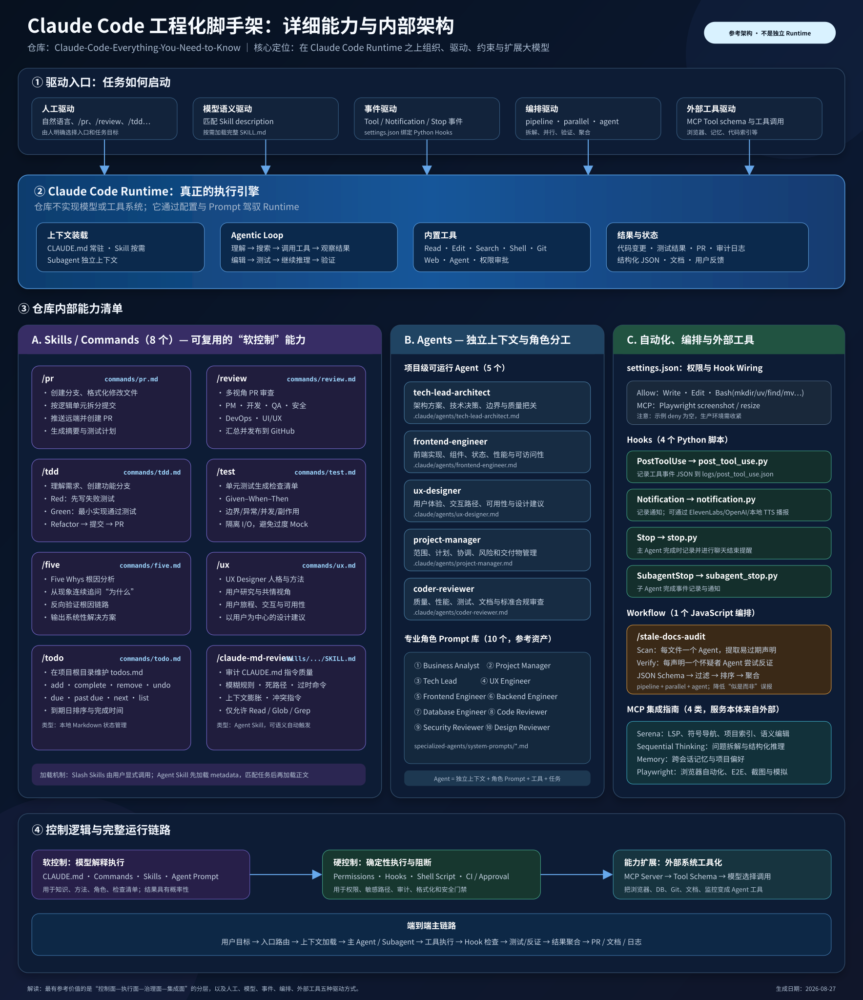

# Claude Code：从入门到精通的工程化指导文档

上游仓库：[wesammustafa/Claude-Code-Everything-You-Need-to-Know](https://github.com/wesammustafa/Claude-Code-Everything-You-Need-to-Know)

- 研究状态：`archived`
- 页面状态：`published`
在线页面：[Claude Code 能力解剖与实践实验室](https://yydshly.github.io/0827_githubcode_study/claude-code-guide/)

## 结论

> 这个仓库可以视为一份 **Claude Code 从入门到精通的工程化指导文档与可运行样例库**。

它不是新的大模型、Claude Code 的二次实现或可直接部署的 Agent 平台。Claude Code 仍然负责模型调用、Agent 循环和工具执行；仓库提供的是如何组织、约束和扩展 Claude Code 的参考方法，包括项目上下文、Skills、Subagents、Hooks、动态 Workflows 和 MCP。

该项目的主要价值是帮助使用者建立完整能力地图，并通过 `.claude/` 中的真实文件理解这些能力如何落地。后续不应复制整套配置，而应根据项目需要逐项阅读、实验、评估和采用。

## 它整理了哪些能力

| 能力层 | 仓库内容 | 主要作用 |
|---|---|---|
| 项目上下文 | `CLAUDE.md` 与 Prompt Engineering 指南 | 保存稳定项目规则、架构事实和团队约定 |
| Slash Skills | `/pr`、`/review`、`/tdd`、`/test`、`/five`、`/ux`、`/todo` | 把重复提示和标准步骤变成可调用工作流 |
| Agent Skill | `/claude-md-review` | 审计 `CLAUDE.md` 中的模糊、过期和膨胀内容 |
| Project Subagents | 代码审查、前端、项目管理、技术架构、UX 设计 5 个角色 | 隔离上下文并委派专业子任务 |
| 专业角色提示词 | 后端、业务分析、数据库、安全、设计等 10 个角色 | 提供可改造成 Agent 的角色基线 |
| Hooks | `PostToolUse`、`Notification`、`Stop`、`SubagentStop` | 在生命周期事件上自动记录、通知或检查 |
| Dynamic Workflow | `stale-docs-audit.js` | 并行提取陈旧声明，再由独立 Agent 反证和聚合 |
| MCP 指南 | Serena、Sequential Thinking、Memory、Playwright | 给 Agent 接入代码语义、推理、记忆和浏览器工具 |

## 核心架构



可以把整个体系理解成五种驱动方式：

1. **人工驱动**：用户输入自然语言需求或 `/tdd`、`/review` 等命令。
2. **语义驱动**：Claude Code 根据 Skill 的 description 判断是否按需加载。
3. **事件驱动**：工具调用或 Agent 状态变化时自动触发 Hook。
4. **编排驱动**：Workflow 显式组织并行、过滤、反证和聚合。
5. **外部工具驱动**：通过 MCP 连接浏览器、记忆、代码索引和其他系统。

其中还需要区分两类控制：

- **软控制**：`CLAUDE.md`、Prompt、Skill、角色说明。它们影响模型判断，但不能保证模型每次都严格遵守。
- **硬控制**：权限、Hooks、测试、CI 和人工审批。它们在模型之外检查、阻止或验收行为。

## 对我们的价值

- 建立 Claude Code 从基础使用到多 Agent 自动化的完整心智模型。
- 理解 Prompt、Skill、Agent、Hook、Workflow 和 MCP 各自应该解决什么问题。
- 将聊天中的经验沉淀为可命名、可版本化、可复用的工程资产。
- 为后续建设模型无关的能力层提供参考：知识、流程、控制和集成可以与模型运行时分离。
- 提供一套低成本练习样例，用来判断不同模型能否稳定驱动 Claude Code 工具协议。

## 建议的理解顺序

不需要一次研究全部内容，推荐按复杂度逐步阅读：

1. `/five`：理解纯 Markdown 如何成为工作流。
2. `/todo`：理解文件如何形成最小持久状态。
3. `/test`：理解检查表如何约束输出质量。
4. `/tdd`：理解 Red → Green → Refactor 阶段控制。
5. `/review`：理解多视角审查与结构化结果。
6. Subagents：理解角色分工与上下文隔离。
7. Hooks：理解事件驱动和程序化治理。
8. `stale-docs-audit` 与 MCP：理解多 Agent 编排和外部能力接入。

## 采用建议

建议提取的是能力契约，而不是 Claude Code 专属目录：

```text
capabilities/
  code-review/
    instructions.md
    input.schema.json
    output.schema.json
    policy.yaml
    evals/

adapters/
  claude-code/
  minimax/
  codex/

connectors/
policies/
```

每项能力至少应明确：触发方式、输入、上下文、指令、工具、状态、输出、副作用、权限、验证方式、失败处理和评测案例。

## 不能直接照搬的部分

- 上游 `settings.json` 的允许权限较宽，而且 `deny` 为空，不是生产最小权限基线。
- `/pr` 和 `/review` 可能产生 commit、push、PR 或 GitHub 评论等外部副作用，必须增加 dry-run 和人工批准。
- Hook 示例会记录完整事件 JSON，可能包含代码、命令、文件路径或秘密，需要脱敏、轮转和并发安全。
- 部分 Hook 命令和解释器路径依赖作者环境，Windows 和团队环境需要重新适配。
- 动态工作流使用的依赖应固定版本，避免 `@latest` 带来的行为漂移和供应链风险。
- 通用角色 Prompt 必须补充我们的领域知识、开发规范、工具权限和结构化输出标准。

## 最终判断

这个项目具有长期参考价值，但当前无需继续投入完整复刻。它应作为：

> **Claude Code 能力地图、从入门到精通的指导资料、Agent 工程参考架构和按需取用的样例库。**

后续遇到具体需求时，再回到对应章节进行理解和实验：重复任务看 Skill，独立专业子任务看 Subagent，自动检查看 Hook，复杂多阶段任务看 Workflow，需要外部系统时看 MCP。

## 本仓库整理产物

- [在线交互学习站](https://yydshly.github.io/0827_githubcode_study/claude-code-guide/)
- [详细能力与架构图](./architecture.svg)
- [上游仓库](https://github.com/wesammustafa/Claude-Code-Everything-You-Need-to-Know)
- [上游 Skills 指南](https://github.com/wesammustafa/Claude-Code-Everything-You-Need-to-Know/blob/main/docs/skills.md)
- [上游动态 Workflow](https://github.com/wesammustafa/Claude-Code-Everything-You-Need-to-Know/blob/main/.claude/workflows/stale-docs-audit.js)

整理时间：2026-08-27。
