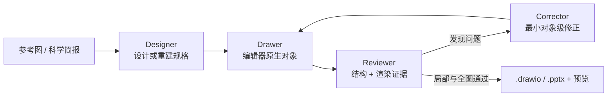

# Scientific Illustrator 研究记录

## 基本信息

| 项目 | 内容 |
| --- | --- |
| 上游仓库 | <https://github.com/icebird1998/scientific-illustrator> |
| 研究基准 | `v1.5.4` / `3a44435da8715b7d380d5b594259e3f495c5b336` |
| 本地源码 | [`upstream/`](upstream/) Git submodule |
| 开源许可证 | MIT |
| 研究状态 | `verified` |
| 最后更新 | 2026-08-27 |
| Web 展示 | [GitHub Pages](https://yydshly.github.io/0827_githubcode_study/scientific-illustrator/) · [本地页面](../../docs/scientific-illustrator/index.html) |

## 一句话定位

Scientific Illustrator 是一个 Codex 插件：它把参考科研图或文字简报拆成结构化设计，再通过 MCP 在 draw.io、Microsoft PowerPoint 或 WPS 演示中重建为尽可能可编辑的对象，并执行结构审计、渲染检查和对象级修正。

它不是“把原图放进 draw.io 展示”，也不是独立的视觉模型。视觉理解和设计判断由 Codex 完成；仓库负责专业编辑器适配、可编辑对象操作、质量门和文件交付。

## 能力地图

基准版本公开了 3 个 MCP 服务、69 个工具：

| 服务 | 工具数 | 核心能力 | 主要输出 |
| --- | ---: | --- | --- |
| `drawio-live` | 26 | 启动/连接画布、形状、图片、线、连接器、表格、图表、分组、对齐、审计、截图、保存 | 可编辑 `.drawio` |
| `drawio-file-utils` | 9 | 状态、显式文件型创建、追踪文档、XML 写入、校验、检查、补丁、导出、打开 | `.drawio`、PNG/SVG/PDF/JPG |
| `powerpoint-live` | 34 | PowerPoint/WPS backend 探测、形状/文字/图片/线/连接器/表格/图表、布局、审计、预览、保存 | 可编辑 `.pptx` 与预览 |

两类入口：

- **参考图重建**：参考图是设计权威，逐区域恢复语义、几何、样式、拓扑和可编辑性。
- **从零设计**：从科学信息简报出发，先生成 backend-neutral `design_spec`，再选择编辑器实现。

## 当前架构

| 层级 | 组成 | 作用 |
| --- | --- | --- |
| 输入层 | 参考科研图或科学简报 | 提供视觉权威或科学意图 |
| 大模型编排层 | Designer、Drawer、Reviewer、Corrector | 负责理解、设计、审阅和最小修正决策 |
| MCP 适配层 | drawio-live、drawio-file-utils、powerpoint-live | 把决策转换成编辑器可执行的对象操作 |
| 编辑器对象层 | mxCell、Shape、TextBox、Connector、Table、Chart | 保持文字、形状和连线独立可编辑 |
| 质量门 | validate、inspect、渲染检查、对象 patch | 同时检查文件结构和视觉结果 |
| 交付层 | .drawio、.pptx 及 SVG/PDF/PNG 预览 | 提供可继续编辑的源文件和发布格式 |
| 展示层（本仓库新增） | GitHub Pages + 本地 Node bridge | 远端展示已验证证据，本地执行真实 MCP |

这个仓库本身不是大模型，也不是动画渲染器。大模型提供理解与决策，MCP 提供受控执行，draw.io/PowerPoint/WPS 提供专业对象模型；动画可以以后建立在这些结构化对象之上，但不属于当前核心交付。

## 核心工作流



质量协议要求每个区域先通过局部循环，再进行全图检查。可重建的文字、边框、箭头、图例、表格和常规图表不能被整块截图替代；确实不可重建的显微照片或复杂纹理必须作为最小原子图片保留，并声明原因和拆解信息。

## Web 能力演示

公开展示：<https://yydshly.github.io/0827_githubcode_study/scientific-illustrator/>

| 模式 | 展示内容 | 是否现场执行 MCP |
| --- | --- | --- |
| GitHub Pages | 加载真实生成并校验过的终稿、对象统计、调用记录和可下载 .drawio | 否；明确标记为静态证据 |
| 本地 Node bridge | 重新执行创建、校验、检查、对象 patch 和复检 | 是 |

本地实时主演示不是预设动画。运行：

```powershell
node studies/scientific-illustrator/demo-server.mjs
```

然后访问 <http://127.0.0.1:8879/scientific-illustrator/#real-lab>。点击“构建完整 LNP–mRNA 案例”后，浏览器请求本地 Node bridge，bridge 启动固定版本的上游 `server.mjs` 并真实执行：

```text
drawio_create_diagram
→ drawio_validate
→ drawio_inspect
→ drawio_update_cells
→ drawio_validate
→ drawio_inspect
```

页面直接展示每次 tool call 的输入摘要、真实耗时、原始返回摘要、结构统计与 3 项对象级修正，并提供本次生成的 `generated/lnp-mrna-antigen-presentation.drawio` 下载。终稿包含 39 个 vertex、19 条 edge、0 张栅格图，由原生 mxCell 构成。

完整目标、设计协议、审阅问题和验收数据见 [CASE-STUDY.md](./CASE-STUDY.md)。

页面下方仍保留 Designer、Drawer、Reviewer、Corrector 四角色动画，但已明确标为工作原理说明，不作为真实执行证据。draw.io / PowerPoint / WPS 后端对比同样是能力说明；当前真实主演示覆盖无需 draw.io Desktop 的文件型 MCP 模式。

## 适用场景

- 论文机制图、实验流程图、技术路线图和 graphical abstract；
- 将旧论文截图、手绘草图或不可编辑示意图恢复为源文件；
- 基金申请、科研汇报和课程材料中的可修改图形；
- 团队统一字体、颜色、间距、箭头和图例规范；
- 需要审计“是否真的可编辑”，而不仅是视觉接近的交付流程。

不适合作为首选方案的场景：像素级照片复刻、密集显微图拼版、复杂纹理和艺术插画、大规模自动数据可视化，以及不需要后续编辑的一次性配图。

## 对我们的意义

1. **补齐可编辑科研图能力。** 相比直接生成 PNG，它能交付可以继续改字、改布局和改连接关系的源文件。
2. **形成通用 Agent-to-Editor 架构。** 同一套“理解 → 执行 → 审阅 → 修正”模式可以迁移到 PPT、白板、流程图和其他专业编辑器。
3. **把生成结果变成可审计资产。** 结构统计、稳定对象 ID、验证记录和增量 patch 使结果可复核，而不是只凭截图判断。
4. **适合团队生产治理。** 可以继续扩展模板、品牌规范、领域符号包、版本 diff、专家批注和批量任务。
5. **为动画与讲解留下结构基础。** 未来可增加时间轴、分步高亮、PPT 动画或视频编排，但应作为独立上层能力建设。

当前采用建议：先把它定位为“可编辑科研图生成与审校底座”，优先用于机制图、实验流程、基金技术路线和需要反复修改的汇报图；不要把它包装成自动科研动画生成器。

## 可扩展方向

1. **统一科学图 IR**：让 Designer 输出稳定场景图，再由 draw.io、PPT、SVG/Figma adapter 渲染。
2. **视觉解析前端**：OCR、面板检测、箭头/拓扑识别、颜色和坐标恢复，降低模型估算误差。
3. **领域符号包**：生命科学、化学、医学、地学、电子和 AI 系统组件库。
4. **约束布局器**：对齐、等距、避障、连接器通道、字体适配和多面板网格求解。
5. **可量化视觉验收**：OCR 一致率、拓扑一致性、感知差异、重叠和无障碍对比度基准。
6. **数据绑定图表**：从图像恢复表格/序列，并重新绑定 CSV、Excel 或实验数据。
7. **稳定编辑器桥接**：减少对私有运行时对象或系统自动化的依赖，强化会话鉴权、并发和恢复。
8. **生产治理**：版本 diff、对象溯源、审阅批注、模板发布和批处理队列。

## 本机验证

- Node.js：`v22.15.0`。
- 仓库结构、可移植性、插件元数据、Python bridge 语法和 MCP smoke tests：通过。
- 工具枚举：`26 + 9 + 34 = 69`，三服务所需 parity tools 存在。
- 完整 `npm test` 在 Office.js bridge smoke 阶段因本机没有 `openssl` 中止；这属于环境前置缺失，不能据此声称后续测试通过。
- 本机未安装 draw.io Desktop，因此实时画布和 CLI 导出尚未实机验证；文件型 `.drawio` 创建与结构校验作为显式演示单独执行。

详见 [`VALIDATION.md`](VALIDATION.md)。

## 主要源码入口

- [`plugins/scientific-illustrator/.mcp.json`](upstream/plugins/scientific-illustrator/.mcp.json)
- [`scripts/live-server.mjs`](upstream/plugins/scientific-illustrator/scripts/live-server.mjs)
- [`scripts/server.mjs`](upstream/plugins/scientific-illustrator/scripts/server.mjs)
- [`scripts/powerpoint-server.mjs`](upstream/plugins/scientific-illustrator/scripts/powerpoint-server.mjs)
- [`skills/recreate-scientific-figure/SKILL.md`](upstream/plugins/scientific-illustrator/skills/recreate-scientific-figure/SKILL.md)
- [`skills/design-scientific-figure/SKILL.md`](upstream/plugins/scientific-illustrator/skills/design-scientific-figure/SKILL.md)
- [`skills/audit-scientific-figure/SKILL.md`](upstream/plugins/scientific-illustrator/skills/audit-scientific-figure/SKILL.md)
- [`skills/correct-scientific-figure/SKILL.md`](upstream/plugins/scientific-illustrator/skills/correct-scientific-figure/SKILL.md)

## 参考资料

- [上游仓库](https://github.com/icebird1998/scientific-illustrator)
- [上游 README](https://github.com/icebird1998/scientific-illustrator#readme)
- [MIT License](upstream/LICENSE)
