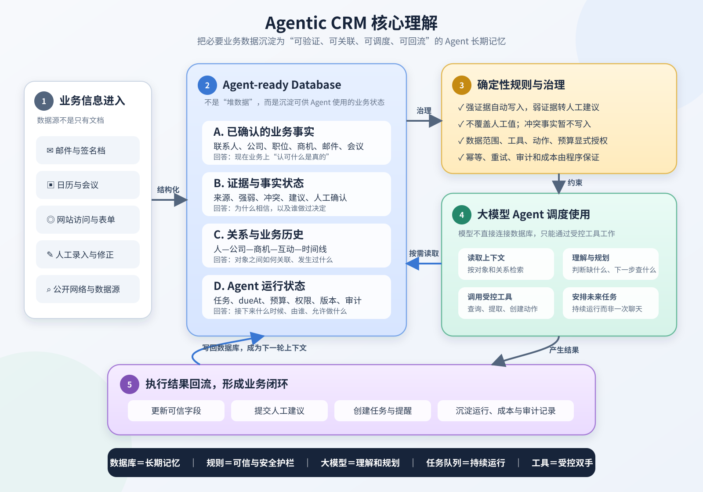
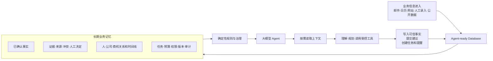
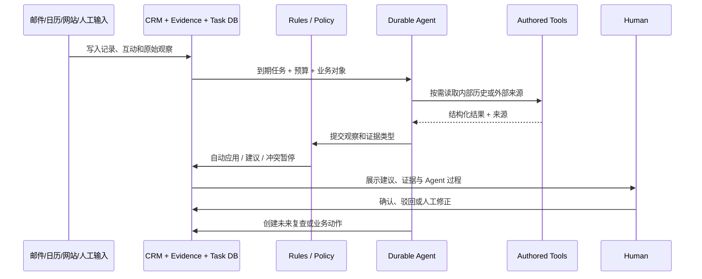

# trycompai/crm 研究记录



## 基本信息

| 项目 | 内容 |
| --- | --- |
| 上游仓库 | [trycompai/crm](https://github.com/trycompai/crm) |
| 研究基准 | [`v1.15.3` / `3c3e07a424f761c2a2f09c05f111dd1b61a29c94`](https://github.com/trycompai/crm/commit/3c3e07a424f761c2a2f09c05f111dd1b61a29c94) |
| 上游发布日期 | 2026-08-21 |
| 开源许可证 | [MIT](https://github.com/trycompai/crm/blob/3c3e07a424f761c2a2f09c05f111dd1b61a29c94/LICENSE) |
| 研究状态 | `researching`：已完成源码与设计文档分析，尚未完成本地运行验证 |
| 最后更新 | 2026-08-27 |

## 研究目标

1. 澄清它是不是“一个供大模型查询的 CRM 数据库”。
2. 拆解它为了实现 Agentic CRM 实际构建了哪些工程能力。
3. 判断哪些能力具有跨业务复用价值，哪些只是 CRM 或特定技术栈实现。
4. 给出后续最小验证计划，避免把源码设计主张误写成已验证效果。

## 一句话结论

`trycompai/crm` 的核心不是几张联系人、公司、商机表，也不是在 CRM 旁边增加一个聊天框。它实现的是一套 Agent-ready 业务运行底座：

```text
结构化业务数据
+ 事实来源与证据状态
+ 实体关系和业务历史
+ 持久任务与运行状态
+ 确定性写入规则
+ 受控工具与权限
+ 大模型理解和规划
= Agentic CRM
```

数据库承担长期记忆和运行状态；大模型负责理解非结构化信息、规划下一步；程序规则负责决定什么可以相信、能否写入、能否执行；任务队列让 Agent 在浏览器关闭、请求结束或进程重启后继续工作。

## 核心理解图



可以把它理解为：

| 组成 | 作用 |
| --- | --- |
| 数据库 | 长期业务记忆、任务和运行状态 |
| Evidence | 事实审核与来源追溯 |
| 确定性规则 | 数据质量、权限和执行安全护栏 |
| 大模型 | 理解非结构化信息、规划和总结 |
| 任务队列 | 持续执行、重试、恢复和未来复查 |
| Tools | Agent 被允许使用的受控双手 |

## 能力地图

| 能力层 | 主要能力 | 关键实现/入口 | 当前证据 |
| --- | --- | --- | --- |
| 基础 CRM | 公司、联系人、商机、活动、邮件、会议、自定义字段 | [`schema.prisma`](https://github.com/trycompai/crm/blob/3c3e07a424f761c2a2f09c05f111dd1b61a29c94/packages/db/prisma/schema.prisma) | 源码模型 |
| 数据进入 | Gmail、Google Calendar、Outlook、网站表单和访问归因 | [README](https://github.com/trycompai/crm/blob/3c3e07a424f761c2a2f09c05f111dd1b61a29c94/README.md)、[`tracking.md`](https://github.com/trycompai/crm/blob/3c3e07a424f761c2a2f09c05f111dd1b61a29c94/docs/tracking.md) | 文档与源码结构 |
| 自动补全 | 联系人识别、公司品牌、职位、公开资料、背景 Brief | [`agent.md`](https://github.com/trycompai/crm/blob/3c3e07a424f761c2a2f09c05f111dd1b61a29c94/docs/agent.md) | 设计文档与工具模型 |
| 事实治理 | Evidence 类型、Verified/Probable/Possible、建议和冲突 | [`evidence.md`](https://github.com/trycompai/crm/blob/3c3e07a424f761c2a2f09c05f111dd1b61a29c94/apps/agent/agent/skills/evidence.md) | 规则与数据模型 |
| 持久 Agent | Task、dueAt、预算、租约、重试、Session、定时复查 | [`agent.md`](https://github.com/trycompai/crm/blob/3c3e07a424f761c2a2f09c05f111dd1b61a29c94/docs/agent.md) | 设计文档与模型 |
| Record Copilot | 在联系人、公司、商机页面读取相关记录和历史并持续对话 | [README](https://github.com/trycompai/crm/blob/3c3e07a424f761c2a2f09c05f111dd1b61a29c94/README.md) | 产品与架构说明 |
| 自定义 Agent | Builder、Manifest、版本、触发器、审查、部署和 Runner | [`agent.md`](https://github.com/trycompai/crm/blob/3c3e07a424f761c2a2f09c05f111dd1b61a29c94/docs/agent.md#team-agent-builder-and-runner) | 设计文档与模型 |
| 受控动作 | CRM Note/Task、Slack 等结构化动作 | Agent Action 与 Manifest 代码路径 | 源码设计；动作范围仍有限 |
| 治理与观测 | Run、Event、Action、Audit、Token、Cost、取消和幂等 | [`schema.prisma`](https://github.com/trycompai/crm/blob/3c3e07a424f761c2a2f09c05f111dd1b61a29c94/packages/db/prisma/schema.prisma) | 源码模型 |

## 为实现目标而构建的工程能力

### 1. Agent-ready Business Memory

普通 RAG 通常保存文档切片和向量；该项目还保存当前业务事实、事实来源、实体关系、互动时间线、待确认建议、冲突、任务、权限和运行状态。

Agent 不直接执行 SQL，而是通过 `read_crm_history`、`read_company_history`、`read_deal_history`、`search_crm` 等受控工具按业务对象读取。读取结果同时返回相邻对象 ID，使 Agent 可以沿联系人—公司—商机关系继续查找，而不是依赖模糊匹配或让用户重复粘贴信息。

**技术价值：** 可抽象为跨业务复用的 Business Memory / Context Service，适用于客服、投研、合规、供应链和企业知识管理。

### 2. Fact & Evidence Engine

项目禁止模型自行提交“90% 置信度”。模型只能报告实际观察到的证据类型，例如邮件回复、签名档、姓名与雇主同时匹配的 LinkedIn、GitHub 身份、公开网页声明或来源冲突。

确定性代码把证据转换为行为：

```text
强证据      → 自动写入
弱证据      → 人工建议
来源冲突    → 暂停写入
无有效来源  → 不进入正式事实
人工填写值  → 默认禁止 AI 覆盖
```

统一写入路径还负责避免重复建议、避免重新提出已驳回值，并保存人工确认或驳回决定。

**技术价值：** 它解决的不是“如何让模型看起来更自信”，而是如何防止 AI 污染长期主数据。这是该仓库最值得复用的设计。

### 3. Durable Agent Task Runtime

研究工作被保存为数据库任务，而不是依赖一次 HTTP 请求。任务包含业务对象、类型、原因、优先级、预算、`dueAt`、`leasedUntil`、尝试次数、Session 和结果。

`claimDue` 通过数据库租约与 `FOR UPDATE SKIP LOCKED` 让多个 Worker 领取不重叠的任务；Worker 崩溃后租约到期可恢复；Agent 可以通过 `schedule_recheck` 创建未来任务并说明原因；额外的 stale reconciliation 负责清理已完成但未正确收口或租约死亡的任务。

**技术价值：** 可沉淀为 Durable Agent Orchestrator，为所有长期后台 Agent 提供统一调度、重试、恢复和预算控制。

### 4. Agent Tool Gateway

Agent Sandbox 默认拒绝网络访问，也不持有 `DATABASE_URL`。数据库读取、外部检索和业务写入只能通过白名单工具。工具代码可以检查当前运行身份、数据范围、动作权限、预算、取消状态和参数结构。

**技术价值：** 把安全边界写进代码，而不是只在 Prompt 中要求模型“不要访问不该访问的数据”。

### 5. Agent Policy Manifest

自定义 Agent 需要显式声明记录范围、可用连接、动作类型和触发条件。自然语言目标不能自动推导为无限权限；空范围也不能被解释为“全部记录”。

**技术价值：** 可以发展为 Agent IAM：Agent Identity + Data Scope + Tool Scope + Action Scope + Budget + Approval Policy。

### 6. Agent Builder 与生命周期控制面

Builder 根据自然语言需求生成 Instructions、Manifest 和 Artifacts，但保存草稿不会自动部署。用户在 Review 页面检查触发器、数据范围、连接、动作权限和文件后，才部署不可变版本；Runner 始终解析被批准版本，并在工具调用时再次验证权限。

核心数据模型包括 AgentDefinition、AgentVersion、AgentTrigger、AgentRun、AgentRunEvent、AgentAction 和 AgentAuditEvent。

**技术价值：** 给出从 Prompt 原型走向企业 Agent Control Plane 的最小闭环：Draft → Review → Deploy → Run → Audit。

### 7. Reliable Action Ledger

每个外部动作先形成结构化记录，并通过幂等键执行。这样即使 Worker 超时、网络响应丢失或任务重试，也能避免重复创建任务或重复发送消息。取消运行只阻止后续动作，不伪装成撤销已经发生的副作用。

**技术价值：** 可抽象为通用 Agent Action Executor，统一管理发送消息、创建工单、修改记录、发起审批等副作用。

### 8. 成本和性能治理

项目把 Logo、头像等无需判断的工作放入确定性直通通道，把身份判断、网页研究和 Brief 总结放入模型通道。每个研究 Session 还带调用预算；未配置的外部能力在调用前被识别为 unavailable，不浪费预算反复失败。

**技术价值：** Agent 架构不应默认“所有步骤都调用最强模型”，而应先做任务分类、确定性执行和能力发现。

## 数据闭环



## 参考价值判断

| 使用方式 | 价值 | 判断 |
| --- | --- | --- |
| Agentic CRM 架构参考 | 高 | Evidence、Durable Task、Tool Gateway、Manifest、Action Ledger 形成完整闭环 |
| 内部小团队 CRM 原型 | 中高 | 基础 CRM、邮箱同步、研究 Agent 和网站线索已形成产品闭环 |
| 现有 CRM 的 AI Sidecar | 高 | 可提取事实治理、研究调度和审计层，而不替换主数据系统 |
| 企业级 CRM 直接替代品 | 低到中 | 缺少角色、字段级和记录级权限，连接器和动作生态有限 |
| 多租户 Agent SaaS 底座 | 中 | Agent 控制面可借鉴，但租户、计费、隔离和合规需要重建 |

真正的技术护城河不是某个模型或 Prompt，而是：

```text
高质量业务数据闭环
+ 来源可追溯的事实治理
+ 可靠的 Agent 调度
+ 最小权限和受控动作
+ 人机协作决策
+ 全链路审计与评测
```

## 不应直接照搬的部分

1. 单组织授权模型：上游明确说明登录后所有用户都可读写所有记录，没有角色、记录级权限或组织隔离。参考：[SECURITY.md](https://github.com/trycompai/crm/blob/3c3e07a424f761c2a2f09c05f111dd1b61a29c94/SECURITY.md)。
2. 写死的 CRM 领域模型和销售阶段。
3. 对 Eve、Vercel、Context.dev、Perplexity、Vercel Blob 等具体实现和供应商的绑定。
4. 当前有限的外部动作与连接器。
5. 尚未经过本研究复测的产品效果、数据准确率和生产稳定性。

## 证据边界

### 已确认的源码事实

- 上游 README 明确将 Agent 定义为独立部署、持久运行和自主安排复查的 CRM 研究执行器。
- `schema.prisma` 中存在 Company、Contact、Deal、ContactFact、AgentTask、AgentDefinition、AgentVersion、AgentTrigger、AgentRun、AgentAction 和 AgentAuditEvent 等模型。
- Agent 文档描述了数据库租约、`FOR UPDATE SKIP LOCKED`、预算、调度、Sandbox、Builder/Runner 和幂等动作。
- Security 文档明确声明单组织、无 RBAC、所有登录用户可读写全部记录。
- Tracking 文档明确声明表单转联系人、第一方采集、不存 IP/查询字符串和敏感字段。

### 尚未由本研究验证

- 本地从零部署是否顺畅。
- Gmail、Microsoft、Context.dev、Perplexity 和 Slack 的真实连通性。
- Agent 自动补全的准确率、人工建议接受率和单条记录成本。
- Worker 崩溃、重复调度和长时间运行时的恢复表现。
- 自定义 Agent Builder 在真实业务需求下的生成质量。
- 大规模联系人和高并发任务下的性能。

因此当前状态保持 `researching`，不能仅凭源码和作者文档标为 `verified`。

## 后续建议

### P0：固定上游并验证三个核心机制

1. 以 `v1.15.3` / `3c3e07a...` 建立独立上游快照，避免研究结论随 `main` 漂移。
2. 运行 Evidence 写入路径测试：强证据自动写入、弱证据建议、人工值不覆盖、冲突暂停。
3. 运行 Task 租约测试：两个 Worker 并发领取、Worker 崩溃、租约超时和任务恢复。
4. 运行 Action 幂等测试：模拟响应丢失和任务重试，确认副作用不重复。
5. 将复现命令、日志和数据库状态保存到独立 `VALIDATION.md`。

### P1：建立四个最小可迁移实验

1. **Evidence Ledger Demo**：脱离 CRM，只实现 Entity、Observation、Evidence、FactDecision 和 HumanReview。
2. **Durable Task Demo**：使用 Postgres 实现 dueAt、lease、attempt、retry 和 recheck。
3. **Tool Policy Demo**：用 Manifest 限制一个 Agent 只能读取选定记录并创建一种动作。
4. **Agent Version Demo**：验证 Draft、Review、Deploy、Run 和 Audit 的不可变版本链。

这些实验比完整部署 CRM 更能回答“哪些技术值得沉淀”。

### P2：形成仓库展示资产

1. 在验证完成后把研究状态提升为 `verified`。
2. 增加 `docs/trycompai-crm/` 页面，交互展示 Business Memory、Evidence、Task Runtime 和 Control Plane。
3. 在根 README 与 `docs/index.html` 增加项目入口；当前工作区这两个文件已有其他改动，本次不混入。
4. 增加准确率、人工修正率、每条事实成本、任务恢复时间和重复动作率等评测指标。
5. 与现有 CRM、RAG、Workflow Engine 和 AI SDR 做边界对比，防止产品定位混淆。

## 最终采用建议

### 现在值得采用

- Evidence 驱动的事实治理。
- 数据库任务作为长期工作的事实源。
- 大模型不直连数据库，所有能力走 Authored Tools。
- Agent 权限 Manifest。
- Draft → Review → Deploy 的不可变版本边界。
- Run/Action/Audit/Cost 全链路记录。
- 确定性任务与 LLM 任务分流。

### 暂不采用

- 整套 CRM 产品和 UI。
- 单租户授权方式。
- 写死的销售流程。
- 特定供应商绑定。
- 未验证就直接承载生产客户数据。

## 参考资料

- [上游 README（固定版本）](https://github.com/trycompai/crm/blob/3c3e07a424f761c2a2f09c05f111dd1b61a29c94/README.md)
- [Agent 架构文档](https://github.com/trycompai/crm/blob/3c3e07a424f761c2a2f09c05f111dd1b61a29c94/docs/agent.md)
- [API 规则](https://github.com/trycompai/crm/blob/3c3e07a424f761c2a2f09c05f111dd1b61a29c94/docs/api.md)
- [Website Tracking 设计](https://github.com/trycompai/crm/blob/3c3e07a424f761c2a2f09c05f111dd1b61a29c94/docs/tracking.md)
- [Prisma 数据模型](https://github.com/trycompai/crm/blob/3c3e07a424f761c2a2f09c05f111dd1b61a29c94/packages/db/prisma/schema.prisma)
- [Evidence Skill](https://github.com/trycompai/crm/blob/3c3e07a424f761c2a2f09c05f111dd1b61a29c94/apps/agent/agent/skills/evidence.md)
- [Identity Matching Skill](https://github.com/trycompai/crm/blob/3c3e07a424f761c2a2f09c05f111dd1b61a29c94/apps/agent/agent/skills/identity-matching.md)
- [Data Boundaries Skill](https://github.com/trycompai/crm/blob/3c3e07a424f761c2a2f09c05f111dd1b61a29c94/apps/agent/agent/skills/data-boundaries.md)
- [Security Policy](https://github.com/trycompai/crm/blob/3c3e07a424f761c2a2f09c05f111dd1b61a29c94/SECURITY.md)
- [Changelog](https://github.com/trycompai/crm/blob/3c3e07a424f761c2a2f09c05f111dd1b61a29c94/CHANGELOG.md)
